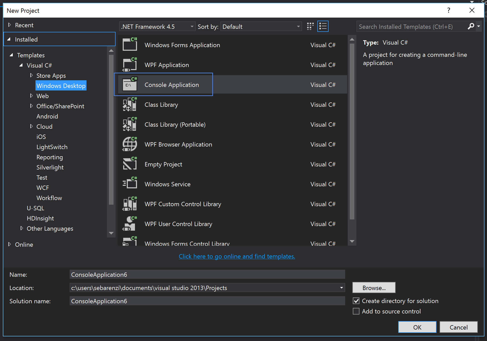

 
# ATIOnet .NET SDK Reference
> **About:** This document describes and explains how to consume the .NET SDK for all ATIOnet APIs.	

</br>

<table>
	<thead>
		<tr>
			<td colspan="2" class="tablehead">Document Information</td>
		</tr>
	</thead>
	<tbody>
		<tr>
			<td width="20%" class="rowhead" align="right">File:</td>
			<td>AN-SDK-Reference</td>
		</tr>
		<tr>
			<td align="right">Doc. Version:</td>
			<td>1.0</td>
		</tr>
		<tr>
			<td align="right">Release Date:</td>
			<td>10, July 2016</td>
		</tr>
		<tr>
			<td align="right">Author:</td>
			<td>ATIOnet LLC</td>
		</tr>
	</tbody>
</table>

<table>
     <thead>
          <tr>
          	<td colspan="3">Change Log</td>
          </tr>
     </thead>
     <tbody>
        <tr>
          	<td>Ver.</td>
            <td>Date</td>
            <td>Change summary</td>
        </tr>
        <!-- Insert a table row like this for each version -->
        <tr>
          	<td>1.0</td>
          	<td>10/July/2016</td>
          	<td>Initial version</td>
        </tr>
        <!-- End of version table row -->
     </tbody>
</table>
</br>

<!--###Table of Content -->

## Contents

<!-- MarkdownTOC depth=3 -->

- [Introduction](#introduction)
- [Download / Installation](#download-installation)
- [Operation Types](#operation-types)
  -  [Auth](#auth)
  -  [FMS](#fms)
  -  [Interface](#interface)
  -  [Loyalty](#loyalty)
  -  [Retail](#retail)
- [Consuming the SDK](#consuming-the-sdk)
  -  [Operation Types methods](#operation-types-methods)
	  -  [Auth Methods](#auth-methods)
	  -  [FMS Methods](#fms-methods)
	  -  [Interface Methods](#interface-methods)
	  -  [Loyalty Methods](#loyalty-methods)
	  -  [Retail Methods](#retail-methods)
-  [Apendix A - Auth Protocol messages](#auth-protocol-messages)

<!-- /MarkdownTOC -->

## Introduction
The ATIOnet SDK (Software development Kit) helps any developer that wants to interact with ATIOnet Platform. If you are integrating an existing software or want to extract data out of ATIOnet, the SDK will make this much easier, taking care of all the HTTP communication, error handling and retry policies.
ATIOnet SDK can be consumed from any .NET language.

## Download / Installation
ATIOnet SDK is hosted in [www.nuget.org](http://www.nuget.org). NuGet is the package manager for the Microsoft development platform including .NET. The NuGet client tools provide the ability to produce and consume packages. The NuGet Gallery is the central package repository used by all package authors and consumers.

## Operation Types
ATIOnet SDK is able to handle most of the ATIOnet modules (Operation Types). These operations are very specific to the responsibility they have in the platform, like for example *Authorization*, *FMS (Fuel Management Systems)*, *Loyalty*, etc. Each of this Operation Type, has a corresponding  module in the SDK. the complete list of *Operations Types* are listed below.

### Auth
The Auth Operation Type is the one in charge of interacting with the authorization engine. The authorization engine is the component that receives authorizations requests and decides if the transaction is approved or not. This SDK Operation Type should be use if you are building a POS or a terminal that will be sending authorization requests to ATIOnet. 

### FMS
The FMS Operation Type is the one in charge of interacting with the FMS module. ATIOnet supports receiving *Inventory* and *Deliveries* transactions through this interface.

### Interface
The Interface Operation Type was design to be used by 3rd party software that need to get information from ATIOnet. With this Operation Type you can download transactions (fleet, loyalty, retail, rejected, approved and exceptions), current account movements, current account balances and loyalty current account.

### Loyalty
The Loyalty Operation Type is the one in charge of interacting with the Loyalty module. Using this Operation Type you will be able to send Loyalty transactions to ATIOnet among other features.

### Retail
The Retail Operation Type is the one in charge of interacting with the Retail module. Using this Operation Type you will be able to send Retail information (transactions, batch closes, etc) to ATIOnet among other features.


## Consuming the SDK
For this example we will use Visual Studio 2013 and we will create a Console Application.

1.  Inside Visual Studio create a new Console Application

1.  Once the project is created, open the *Solution Explorer*, right click the project and select *Manage NuGet Packages*. This will open a pop up.


3.  Inside the NuGet pop up, in the left part select *Online*, then in the right top corner type *ationet*. This will bring the list of packages found with this criteria. In this case only 1, **ATIOnet SDK**. Click *Install*, this will install the ATIOnet SDK packages and dependencies. Please accept terms and conditions for dependencies packages. 


1.  In the sample below you will see how to download transactions. Open the Program.cs and type the following code:

```javascript


var client = new Ationet.Sdk.Interface.InterfaceOperations("https://native.ationet.com/", 
    "[YOUR-USERNAME]", "[YOUR-PASSWORD]");
var transactions = client.GetTransactions("XYZ", "", "", DateTime.Now.AddDays(-1));

foreach (var tran in transactions.Content)
{
    Console.WriteLine("{0} - {1} - {2}", tran.AuthorizationCode, tran.TerminalCode, tran.ProductAmountDispensed);
}


```

First, you need an instance of the *InterfaceOperations* class. The constructor of this class requires 3 parameters, the url, username and password.
Once you have an instance of the *InterfaceOperations* class you can start calling the different methods. Find below the list of all the methods by *Operation Type*:


## Operation Types methods
Each Operation Type class has multiple methods to perform specific operation against ATIOnet. Each of this methods has a set of parameters, some of them to determine behaviour and others to filter data.

### Auth Methods


<table>
     <thead>
        <tr> 
			<td>Method</td>
			<td>Parameters</td>
			<td>Description</td>
		</tr>
     </thead>
     <tbody>
        <tr>
          	<td>SendConfirmation</td>
            <td>AuthTransactionRequest</td>
            <td>Sends a <i>Confirmation</i> message to the host (learn more about transactions flow here:</td>
        </tr>
        <tr>
          	<td>SendConfirmationAsync</td>
            <td>AuthTransactionRequest</td>
            <td>Async version of the previous method</td>
        </tr>
        <tr>
          	<td>SendPreAuthorization</td>
            <td>AuthTransactionRequest</td>
            <td>Sends a <i>Pre Authorization</i> message to the host (learn more about transactions flow here:</td>
        </tr>
        <tr>
          	<td>SendPreAuthorizationAsync</td>
            <td>AuthTransactionRequest</td>
            <td>Async version of the previous method</td>
        </tr>
        <tr>
          	<td>SendSale</td>
            <td>AuthTransactionRequest</td>
            <td>Sends a <i>Sale</i> message to the host (learn more about transactions flow here:</td>
        </tr>
        <tr>
          	<td>SendSaleAsync</td>
            <td>AuthTransactionRequest</td>
            <td>Async version of the previous method</td>
        </tr>
	</tbody>
</table>
<BR/>
You can download a fully functional sample code from here: https://github.com/atioint/ationetsdksamples/tree/master/AtionetAuthSample](https://github.com/atioint/ationetsdksamples/tree/master/AtionetAuthSample

### FMS Methods
<table>
     <thead>
        <tr> 
			<td>Method</td>
			<td>Parameters</td>
			<td>Description</td>
		</tr>
     </thead>
     <tbody>
        <tr>
          	<td>UploadNativeDeliveries</td>
            <td>TerminalCode (string), trama (List<FMSDeliveryData>), SystemModel (string), SystemVersion (string)</td>
            <td>loren impsum</td>
        </tr>
        <tr>
          	<td>UploadNativeDelivery</td>
            <td>TerminalCode (string), trama (FMSDeliveryData), SystemModel (string), SystemVersion (string)</td>
            <td>loren impsum</td>
        </tr>
        <tr>
          	<td>UploadNativeInventories</td>
            <td>TerminalCode (string), trama (List<FMSInventoryData>), SystemModel (string), SystemVersion (string)</td>
            <td>loren impsum</td>
        </tr>
        <tr>
          	<td>UploadNativeInventory</td>
            <td>TerminalCode (string), trama (FMSInventoryData), SystemModel (string), SystemVersion (string)</td>
            <td>loren impsum</td>
        </tr>
	</tbody>
</table>

### Interface Methods
<table>
     <thead>
        <tr> 
			<td>Method</td>
			<td>Parameters</td>
			<td>Description</td>
		</tr>
     </thead>
     <tbody>
        <tr>
          	<td>BalanceTransferContractToSubAccount</td>
            <td></td>
            <td>Transfers money from the contract to a sub account</td>
        </tr>
        <tr>
          	<td>BalanceTransferSubAccountToContract</td>
          	<td></td>
          	<td>Transfers money from the sub account to the contract</td>
        </tr>
        <tr>
          	<td>BalanceTransferSubAccountToSubAccount</td>
            <td></td>
            <td>Transfers money between sub accounts</td>
        </tr>
        <tr>
          	<td>BalanceTransferToContract</td>
            <td></td>
            <td>Transfers (deposit) money to a contract</td>
        </tr>
        <tr>
          	<td>BalanceTransferToSubAccount</td>
            <td></td>
            <td>Transfers (deposit) money to a sub account</td>
        </tr>
        <tr>
          	<td>BalanceWithdrawFromContract</td>
            <td></td>
            <td>Removes (Withdraw) money from a contract</td>
        </tr>
        <tr>
          	<td>BalanceWithdrawFromSubAccount</td>
            <td></td>
            <td>This method removes (Withdraw) money from a sub account</td>
        </tr>
        <tr>
          	<td>ContractBalanceDownload</td>
            <td></td>
            <td>This method downloads a contracts balances list</td>
        </tr>
        <tr>
          	<td>GetDeliveries</td>
            <td></td>
            <td>This method downloads a deliveries list</td>
        </tr>
        <tr>
          	<td>GetExceptions</td>
            <td></td>
            <td>This method downloads a transaction exceptions list</td>
        </tr>
        <tr>
          	<td>GetInventories</td>
            <td></td>
            <td>This method downloads an inventories list</td>
        </tr>
        <tr>
          	<td>GetMovements</td>
            <td></td>
            <td>This method downloads current account movements</td>
        </tr>
        <tr>
          	<td>GetRetailBatchCloses</td>
            <td></td>
            <td>This method downloads retail batch closes</td>
        </tr>
        <tr>
          	<td>GetRetailTransactions</td>
            <td></td>
            <td>This method downloads retail transactions</td>
        </tr>
        <tr>
          	<td>GetStatements</td>
            <td></td>
            <td>This method downloads the statements</td>
        </tr>
        <tr>
          	<td>GetTransactions</td>
            <td></td>
            <td>This method downloads fleet transactions</td>
        </tr>
        <tr>
          	<td>GetUncontrolledTransactions</td>
            <td></td>
            <td>This method downloads uncontrolled transactions</td>
        </tr>
        <tr>
          	<td>InsertFastTrackOrder</td>
            <td></td>
            <td>This method inserts fast tracks (trip orders)</td>
        </tr>
        <tr>
          	<td>SubAccountBalanceDownload</td>
            <td></td>
            <td>This method downloads the balance of the sub accounts</td>
        </tr>
     </tbody>
</table>

### Loyalty Methods
<table>
     <thead>
        <tr> 
			<td>Method</td>
			<td>Parameters</td>
			<td>Description</td>
		</tr>
     </thead>
     <tbody>
        <tr>
          	<td>SendLoyaltyAccumulation</td>
            <td></td>
            <td>loren impsum</td>
        </tr>
        <tr>
          	<td>SendLoyaltyAccumulationAsync</td>
            <td></td>
            <td>loren impsum</td>
        </tr>
        <tr>
          	<td>SendLoyaltyBalanceInquiry</td>
            <td></td>
            <td>loren impsum</td>
        </tr>
        <tr>
          	<td>SendLoyaltyBalanceInquiryAsync</td>
            <td></td>
            <td>loren impsum</td>
        </tr>
	</tbody>
</table>

### Retail Methods
<table>
     <thead>
        <tr> 
			<td>Method</td>
			<td>Parameters</td>
			<td>Description</td>
		</tr>
     </thead>
     <tbody>
        <tr>
          	<td>SendRetailBatchClose</td>
            <td></td>
            <td>loren impsum</td>
        </tr>
        <tr>
          	<td>SendRetailBatchCloseAsync</td>
            <td></td>
            <td>loren impsum</td>
        </tr>
        <tr>
          	<td>SendSaleRecordsUpload</td>
            <td></td>
            <td>loren impsum</td>
        </tr>
        <tr>
          	<td>SendSaleRecordsUploadAsync</td>
            <td></td>
            <td>loren impsum</td>
        </tr>
	</tbody>
</table>

## Apendix A - Auth Protocol messages
<table border="1">
	<thead>
		<tr valign="top">
			<th align="left" rowspan="2" valign="middle">
				Value
			</th>
			<th align="left" rowspan="2" valign="middle">
				Description
			</th>
		</tr>	
	</thead>
	<tbody>
		<tr valign="top">
			<td>
				<p align="left">M</p>
			</td>
			<td>
				<p align="left">Mandatory</p>
			</td>
		</tr>
		<tr valign="top">
			<td>
				<p align="left">M1</p>
			</td>
			<td>
				<p align="left">Mandatory. The same as original request</p>
			</td>
		</tr>
		<tr valign="top">
			<td>
				<p align="left">M2</p>
			</td>
			<td>
				<p align="left">Mandatory. The same as pre-authorization</p>
			</td>
		</tr>
		<tr valign="top">
			<td>
				<p align="left">E</p>
			</td>
			<td>
				<p align="left">Echo</p>
			</td>
		</tr>
		<tr valign="top">
			<td>
				<p align="left">E1</p>
			</td>
			<td>
				<p align="left">Echo from original request</p>
			</td>
		</tr>
		<tr valign="top">
			<td>
				<p align="left">O</p>
			</td>
			<td>
				<p align="left">Optional</p>
			</td>
		</tr>
		<tr valign="top">
			<td>
				<p align="left">C</p>
			</td>
			<td>
				<p align="left">Conditional</p>
			</td>
		</tr>
		<tr valign="top">
			<td>
				<p align="left">C1</p>
			</td>
			<td>
				<p align="left">At least one field must be send</p>
			</td>
		</tr>
		<tr valign="top">
			<td>
				<p align="left">C2</p>
			</td>
			<td>
				<p align="left">Mandatory if product quantity is present</p>
			</td>
		</tr>
		<tr valign="top">
			<td>
				<p align="left">C3</p>
			</td>
			<td>
				<p align="left">At least one field must be sent. The same as original request</p>
			</td>
		</tr>
	</tbody>
</table>
</br>	
<table border="1">
	<thead>
		<tr valign="top">
			<th align="left" rowspan="2" valign="middle">
				Field Name
			</th>
			<th align="left" rowspan="2" valign="middle">
				Size
			</th>
			<th align="left" rowspan="2" valign="middle">
				Type
			</th>
			<th align="left" colspan="2">
				Pre-authorization
			</th>
			<th align="left" colspan="2">
				Completion
			</th>
			<th align="left" colspan="2">
				Contingency
			</th>
			<th align="left" colspan="2">
				Offline
			</th>
			<th align="left" colspan="2">
				Cancellation
			</th>
			<th align="left" colspan="2">
				Void
			</th>
		</tr>
		<tr valign="top">
			<th align="left">
				Request
			</th>
			<th align="left">
				Response
			</th>
			<th align="left">
				Request
			</th>
			<th align="left">
				Response
			</th>
			<th align="left">
				Request
			</th>
			<th align="left">
				Response
			</th>
			<th align="left">
				Request
			</th>
			<th align="left">
				Response
			</th>
			<th align="left">
				Request
			</th>
			<th align="left">
				Response
			</th>
			<th align="left">
				Request
			</th>
			<th align="left">
				Response
			</th>
		</tr>
	</thead>
	<tbody>
		<tr valign="top">
			<td>
				<p align="left">ApplicationType</p>
			</td>
			<td>
				<p align="left">3</p>
			</td>
			<td>
				<p align="left">string</p>
			</td>
			<td>
				<p align="left">M</p>
			</td>
			<td>
				<p align="left">E</p>
			</td>
			<td>
				<p align="left">M</p>
			</td>
			<td>
				<p align="left">E</p>
			</td>
			<td>
				<p align="left">M</p>
			</td>
			<td>
				<p align="left">E</p>
			</td>
			<td>
				<p align="left">M</p>
			</td>
			<td>
				<p align="left">E</p>
			</td>
			<td>
				<p align="left">M</p>
			</td>
			<td>
				<p align="left">E1</p>
			</td>
			<td>
				<p align="left">M</p>
			</td>
			<td>
				<p align="left">E1</p>
			</td>
		</tr>
		<tr valign="top">
			<td>
				<p align="left">ProcessingMode</p>
			</td>
			<td>
				<p align="left">1</p>
			</td>
			<td>
				<p align="left">string</p>
			</td>
			<td>
				<p align="left">M</p>
			</td>
			<td>
				<p align="left">E</p>
			</td>
			<td>
				<p align="left">M</p>
			</td>
			<td>
				<p align="left">E</p>
			</td>
			<td>
				<p align="left">M</p>
			</td>
			<td>
				<p align="left">E</p>
			</td>
			<td>
				<p align="left">M</p>
			</td>
			<td>
				<p align="left">E</p>
			</td>
			<td>
				<p align="left">M</p>
			</td>
			<td>
				<p align="left">E1</p>
			</td>
			<td>
				<p align="left">M</p>
			</td>
			<td>
				<p align="left">E1</p>
			</td>
		</tr>
		<tr valign="top">
			<td>
				<p align="left">MessageFormatVersion</p>
			</td>
			<td>
				<p align="left">3</p>
			</td>
			<td>
				<p align="left">string</p>
			</td>
			<td>
				<p align="left">M</p>
			</td>
			<td>
				<p align="left">E</p>
			</td>
			<td>
				<p align="left">M</p>
			</td>
			<td>
				<p align="left">E</p>
			</td>
			<td>
				<p align="left">M</p>
			</td>
			<td>
				<p align="left">E</p>
			</td>
			<td>
				<p align="left">M</p>
			</td>
			<td>
				<p align="left">E</p>
			</td>
			<td>
				<p align="left">M</p>
			</td>
			<td>
				<p align="left">E1</p>
			</td>
			<td>
				<p align="left">M</p>
			</td>
			<td>
				<p align="left">E1</p>
			</td>
		</tr>
		<tr valign="top">
			<td>
				<p align="left">TerminalIdentification</p>
			</td>
			<td>
				<p align="left">Var</p>
			</td>
			<td>
				<p align="left">string</p>
			</td>
			<td>
				<p align="left">M</p>
			</td>
			<td>
				<p align="left">E</p>
			</td>
			<td>
				<p align="left">M</p>
			</td>
			<td>
				<p align="left">E</p>
			</td>
			<td>
				<p align="left">M</p>
			</td>
			<td>
				<p align="left">E</p>
			</td>
			<td>
				<p align="left">M</p>
			</td>
			<td>
				<p align="left">E</p>
			</td>
			<td>
				<p align="left">M</p>
			</td>
			<td>
				<p align="left">E1</p>
			</td>
			<td>
				<p align="left">M</p>
			</td>
			<td>
				<p align="left">E1</p>
			</td>
		</tr>
		<tr valign="top">
			<td>
				<p align="left">DeviceTypeIdentifier</p>
			</td>
			<td>
				<p align="left">1</p>
			</td>
			<td>
				<p align="left">string</p>
			</td>
			<td>
				<p align="left">M</p>
			</td>
			<td>
				<p align="left">E</p>
			</td>
			<td>
				<p align="left">M</p>
			</td>
			<td>
				<p align="left">E</p>
			</td>
			<td>
				<p align="left">M</p>
			</td>
			<td>
				<p align="left">E</p>
			</td>
			<td>
				<p align="left">M</p>
			</td>
			<td>
				<p align="left">E</p>
			</td>
			<td>
				<p align="left">M</p>
			</td>
			<td>
				<p align="left">E1</p>
			</td>
			<td>
				<p align="left">M</p>
			</td>
			<td>
				<p align="left">E1</p>
			</td>
		</tr>
		<tr valign="top">
			<td>
				<p align="left">SystemModel</p>
			</td>
			<td>
				<p align="left">10</p>
			</td>
			<td>
				<p align="left">string</p>
			</td>
			<td>
				<p align="left">M</p>
			</td>
			<td>
				<p align="left"></p>
			</td>
			<td>
				<p align="left">M</p>
			</td>
			<td>
				<p align="left"></p>
			</td>
			<td>
				<p align="left">M</p>
			</td>
			<td>
				<p align="left"></p>
			</td>
			<td>
				<p align="left">M</p>
			</td>
			<td>
				<p align="left"></p>
			</td>
			<td>
				<p align="left">M</p>
			</td>
			<td>
				<p align="left"></p>
			</td>
			<td>
				<p align="left">M</p>
			</td>
			<td>
				<p align="left"></p>
			</td>
		</tr>
		<tr valign="top">
			<td>
				<p align="left">SystemVersion</p>
			</td>
			<td>
				<p align="left">10</p>
			</td>
			<td>
				<p align="left">string</p>
			</td>
			<td>
				<p align="left">M</p>
			</td>
			<td>
				<p align="left"></p>
			</td>
			<td>
				<p align="left">M</p>
			</td>
			<td>
				<p align="left"></p>
			</td>
			<td>
				<p align="left">M</p>
			</td>
			<td>
				<p align="left"></p>
			</td>
			<td>
				<p align="left">M</p>
			</td>
			<td>
				<p align="left"></p>
			</td>
			<td>
				<p align="left">M</p>
			</td>
			<td>
				<p align="left"></p>
			</td>
			<td>
				<p align="left">M</p>
			</td>
			<td>
				<p align="left"></p>
			</td>
		</tr>
		<tr valign="top">
			<td>
				<p align="left">TransactionCode</p>
			</td>
			<td>
				<p align="left">3</p>
			</td>
			<td>
				<p align="left">string</p>
			</td>
			<td>
				<p align="left">100</p>
			</td>
			<td>
				<p align="left">110</p>
			</td>
			<td>
				<p align="left">120</p>
			</td>
			<td>
				<p align="left">130</p>
			</td>
			<td>
				<p align="left">126</p>
			</td>
			<td>
				<p align="left">130</p>
			</td>
			<td>
				<p align="left">125</p>
			</td>
			<td>
				<p align="left">130</p>
			</td>
			<td>
				<p align="left">400</p>
			</td>
			<td>
				<p align="left">410</p>
			</td>
			<td>
				<p align="left">220</p>
			</td>
			<td>
				<p align="left">230</p>
			</td>
		</tr>
		<tr valign="top">
			<td>
				<p align="left">AccountType</p>
			</td>
			<td>
				<p align="left">1</p>
			</td>
			<td>
				<p align="left">string</p>
			</td>
			<td>
				<p align="left">M</p>
			</td>
			<td>
				<p align="left">E</p>
			</td>
			<td>
				<p align="left">M</p>
			</td>
			<td>
				<p align="left">E</p>
			</td>
			<td>
				<p align="left">M</p>
			</td>
			<td>
				<p align="left">E</p>
			</td>
			<td>
				<p align="left">M</p>
			</td>
			<td>
				<p align="left">E</p>
			</td>
			<td>
				<p align="left">M</p>
			</td>
			<td>
				<p align="left">E1</p>
			</td>
			<td>
				<p align="left">M</p>
			</td>
			<td>
				<p align="left">E1</p>
			</td>
		</tr>
		<tr valign="top">
			<td>
				<p align="left">EntryMethod</p>
			</td>
			<td>
				<p align="left">1</p>
			</td>
			<td>
				<p align="left">string</p>
			</td>
			<td>
				<p align="left">M</p>
			</td>
			<td>
				<p align="left">E</p>
			</td>
			<td>
				<p align="left">M</p>
			</td>
			<td>
				<p align="left">E</p>
			</td>
			<td>
				<p align="left">M</p>
			</td>
			<td>
				<p align="left">E</p>
			</td>
			<td>
				<p align="left">M</p>
			</td>
			<td>
				<p align="left">E</p>
			</td>
			<td>
				<p align="left">M</p>
			</td>
			<td>
				<p align="left">E1</p>
			</td>
			<td>
				<p align="left">M</p>
			</td>
			<td>
				<p align="left">E1</p>
			</td>
		</tr>
		<tr valign="top">
			<td>
				<p align="left">ServiceCode</p>
			</td>
			<td>
				<p align="left">1</p>
			</td>
			<td>
				<p align="left">string</p>
			</td>
			<td>
				<p align="left"></p>
			</td>
			<td>
				<p align="left"></p>
			</td>
			<td>
				<p align="left"></p>
			</td>
			<td>
				<p align="left"></p>
			</td>
			<td>
				<p align="left"></p>
			</td>
			<td>
				<p align="left"></p>
			</td>
			<td>
				<p align="left"></p>
			</td>
			<td>
				<p align="left"></p>
			</td>
			<td>
				<p align="left"></p>
			</td>
			<td>
				<p align="left"></p>
			</td>
			<td>
				<p align="left"></p>
			</td>
			<td>
				<p align="left"></p>
			</td>
		</tr>
		<tr valign="top">
			<td>
				<p align="left">PumpNumber</p>
			</td>
			<td>
				<p align="left">2</p>
			</td>
			<td>
				<p align="left">string</p>
			</td>
			<td>
				<p align="left"></p>
			</td>
			<td>
				<p align="left">E</p>
			</td>
			<td>
				<p align="left"></p>
			</td>
			<td>
				<p align="left">E</p>
			</td>
			<td>
				<p align="left"></p>
			</td>
			<td>
				<p align="left">E</p>
			</td>
			<td>
				<p align="left"></p>
			</td>
			<td>
				<p align="left">E</p>
			</td>
			<td>
				<p align="left"></p>
			</td>
			<td>
				<p align="left">E1</p>
			</td>
			<td>
				<p align="left"></p>
			</td>
			<td>
				<p align="left">E1</p>
			</td>
		</tr>
		<tr valign="top">
			<td>
				<p align="left">ProductCode</p>
			</td>
			<td>
				<p align="left">4</p>
			</td>
			<td>
				<p align="left">string</p>
			</td>
			<td>
				<p align="left">O</p>
			</td>
			<td>
				<p align="left">C</p>
			</td>
			<td>
				<p align="left">C2</p>
			</td>
			<td>
				<p align="left"></p>
			</td>
			<td>
				<p align="left">C2</p>
			</td>
			<td>
				<p align="left"></p>
			</td>
			<td>
				<p align="left">C2</p>
			</td>
			<td>
				<p align="left"></p>
			</td>
			<td>
				<p align="left"></p>
			</td>
			<td>
				<p align="left"></p>
			</td>
			<td>
				<p align="left"></p>
			</td>
			<td>
				<p align="left"></p>
			</td>
		</tr>
		<tr valign="top">
			<td>
				<p align="left">ProductUnitPrice</p>
			</td>
			<td>
				<p align="left">Var</p>
			</td>
			<td>
				<p align="left">decimal</p>
			</td>
			<td>
				<p align="left">O</p>
			</td>
			<td>
				<p align="left">C</p>
			</td>
			<td>
				<p align="left">O</p>
			</td>
			<td>
				<p align="left"></p>
			</td>
			<td>
				<p align="left">O</p>
			</td>
			<td>
				<p align="left"></p>
			</td>
			<td>
				<p align="left">O</p>
			</td>
			<td>
				<p align="left"></p>
			</td>
			<td>
				<p align="left"></p>
			</td>
			<td>
				<p align="left"></p>
			</td>
			<td>
				<p align="left"></p>
			</td>
			<td>
				<p align="left"></p>
			</td>
		</tr>
		<tr valign="top">
			<td>
				<p align="left">ProductNetAmount</p>
			</td>
			<td>
				<p align="left">Var</p>
			</td>
			<td>
				<p align="left">decimal</p>
			</td>
			<td>
				<p align="left"></p>
			</td>
			<td>
				<p align="left"></p>
			</td>
			<td>
				<p align="left"></p>
			</td>
			<td>
				<p align="left"></p>
			</td>
			<td>
				<p align="left"></p>
			</td>
			<td>
				<p align="left"></p>
			</td>
			<td>
				<p align="left"></p>
			</td>
			<td>
				<p align="left"></p>
			</td>
			<td>
				<p align="left"></p>
			</td>
			<td>
				<p align="left"></p>
			</td>
			<td>
				<p align="left"></p>
			</td>
			<td>
				<p align="left"></p>
			</td>
		</tr>
		<tr valign="top">
			<td>
				<p align="left">ProductTaxes</p>
			</td>
			<td>
				<p align="left">Var</p>
			</td>
			<td>
				<p align="left">Dictionary[string, decimal]</p>
			</td>
			<td>
				<p align="left">O</p>
			</td>
			<td>
				<p align="left"></p>
			</td>
			<td>
				<p align="left">0</p>
			</td>
			<td>
				<p align="left"></p>
			</td>
			<td>
				<p align="left">O</p>
			</td>
			<td>
				<p align="left"></p>
			</td>
			<td>
				<p align="left">O</p>
			</td>
			<td>
				<p align="left"></p>
			</td>
			<td>
				<p align="left"></p>
			</td>
			<td>
				<p align="left"></p>
			</td>
			<td>
				<p align="left"></p>
			</td>
			<td>
				<p align="left"></p>
			</td>
		</tr>
		<tr valign="top">
			<td>
				<p align="left">ProductAmount</p>
			</td>
			<td>
				<p align="left">Var</p>
			</td>
			<td>
				<p align="left">decimal</p>
			</td>
			<td>
				<p align="left">O</p>
			</td>
			<td>
				<p align="left">C</p>
			</td>
			<td>
				<p align="left">C1</p>
			</td>
			<td>
				<p align="left"></p>
			</td>
			<td>
				<p align="left">C1</p>
			</td>
			<td>
				<p align="left"></p>
			</td>
			<td>
				<p align="left">C1</p>
			</td>
			<td>
				<p align="left"></p>
			</td>
			<td>
				<p align="left"></p>
			</td>
			<td>
				<p align="left"></p>
			</td>
			<td>
				<p align="left"></p>
			</td>
			<td>
				<p align="left"></p>
			</td>
		</tr>
		<tr valign="top">
			<td>
				<p align="left">ProductQuantity</p>
			</td>
			<td>
				<p align="left">Var</p>
			</td>
			<td>
				<p align="left">decimal</p>
			</td>
			<td>
				<p align="left">O</p>
			</td>
			<td>
				<p align="left">C</p>
			</td>
			<td>
				<p align="left">C1</p>
			</td>
			<td>
				<p align="left"></p>
			</td>
			<td>
				<p align="left">C1</p>
			</td>
			<td>
				<p align="left"></p>
			</td>
			<td>
				<p align="left">C1</p>
			</td>
			<td>
				<p align="left"></p>
			</td>
			<td>
				<p align="left"></p>
			</td>
			<td>
				<p align="left"></p>
			</td>
			<td>
				<p align="left"></p>
			</td>
			<td>
				<p align="left"></p>
			</td>
		</tr>
		<tr valign="top">
			<td>
				<p align="left">TransactionNetAmount</p>
			</td>
			<td>
				<p align="left">Var</p>
			</td>
			<td>
				<p align="left">decimal</p>
			</td>
			<td>
				<p align="left"></p>
			</td>
			<td>
				<p align="left"></p>
			</td>
			<td>
				<p align="left"></p>
			</td>
			<td>
				<p align="left"></p>
			</td>
			<td>
				<p align="left"></p>
			</td>
			<td>
				<p align="left"></p>
			</td>
			<td>
				<p align="left"></p>
			</td>
			<td>
				<p align="left"></p>
			</td>
			<td>
				<p align="left"></p>
			</td>
			<td>
				<p align="left"></p>
			</td>
			<td>
				<p align="left"></p>
			</td>
			<td>
				<p align="left"></p>
			</td>
		</tr>
		<tr valign="top">
			<td>
				<p align="left">ProductData</p>
			</td>
			<td>
				<p align="left">Var</p>
			</td>
			<td>
				<p align="left">List[AtionetProduct]</p>
			</td>
			<td>
				<p align="left">O</p>
			</td>
			<td>
				<p align="left"></p>
			</td>
			<td>
				<p align="left">O</p>
			</td>
			<td>
				<p align="left"></p>
			</td>
			<td>
				<p align="left">O</p>
			</td>
			<td>
				<p align="left"></p>
			</td>
			<td>
				<p align="left">O</p>
			</td>
			<td>
				<p align="left"></p>
			</td>
			<td>
				<p align="left"></p>
			</td>
			<td>
				<p align="left"></p>
			</td>
			<td>
				<p align="left"></p>
			</td>
			<td>
				<p align="left"></p>
			</td>
		</tr>
		<tr valign="top">
			<td>
				<p align="left">TransactionAmount</p>
			</td>
			<td>
				<p align="left">Var</p>
			</td>
			<td>
				<p align="left">decimal</p>
			</td>
			<td>
				<p align="left">O</p>
			</td>
			<td>
				<p align="left">C</p>
			</td>
			<td>
				<p align="left">C1</p>
			</td>
			<td>
				<p align="left"></p>
			</td>
			<td>
				<p align="left">C1</p>
			</td>
			<td>
				<p align="left"></p>
			</td>
			<td>
				<p align="left">C1</p>
			</td>
			<td>
				<p align="left"></p>
			</td>
			<td>
				<p align="left"></p>
			</td>
			<td>
				<p align="left"></p>
			</td>
			<td>
				<p align="left"></p>
			</td>
			<td>
				<p align="left"></p>
			</td>
		</tr>
		<tr valign="top">
			<td>
				<p align="left">UnitCode</p>
			</td>
			<td>
				<p align="left">Var</p>
			</td>
			<td>
				<p align="left">string</p>
			</td>
			<td>
				<p align="left">O</p>
			</td>
			<td>
				<p align="left">E</p>
			</td>
			<td>
				<p align="left">O</p>
			</td>
			<td>
				<p align="left"></p>
			</td>
			<td>
				<p align="left">O</p>
			</td>
			<td>
				<p align="left"></p>
			</td>
			<td>
				<p align="left">O</p>
			</td>
			<td>
				<p align="left"></p>
			</td>
			<td>
				<p align="left"></p>
			</td>
			<td>
				<p align="left"></p>
			</td>
			<td>
				<p align="left"></p>
			</td>
			<td>
				<p align="left"></p>
			</td>
		</tr>
		<tr valign="top">
			<td>
				<p align="left">CurrencyCode</p>
			</td>
			<td>
				<p align="left">3</p>
			</td>
			<td>
				<p align="left">string</p>
			</td>
			<td>
				<p align="left"></p>
			</td>
			<td>
				<p align="left">E</p>
			</td>
			<td>
				<p align="left"></p>
			</td>
			<td>
				<p align="left"></p>
			</td>
			<td>
				<p align="left"></p>
			</td>
			<td>
				<p align="left"></p>
			</td>
			<td>
				<p align="left"></p>
			</td>
			<td>
				<p align="left"></p>
			</td>
			<td>
				<p align="left"></p>
			</td>
			<td>
				<p align="left"></p>
			</td>
			<td>
				<p align="left"></p>
			</td>
			<td>
				<p align="left"></p>
			</td>
		</tr>
		<tr valign="top">
			<td>
				<p align="left">BatchNumber</p>
			</td>
			<td>
				<p align="left">Var</p>
			</td>
			<td>
				<p align="left">int</p>
			</td>
			<td>
				<p align="left"></p>
			</td>
			<td>
				<p align="left">E</p>
			</td>
			<td>
				<p align="left"></p>
			</td>
			<td>
				<p align="left"></p>
			</td>
			<td>
				<p align="left"></p>
			</td>
			<td>
				<p align="left"></p>
			</td>
			<td>
				<p align="left"></p>
			</td>
			<td>
				<p align="left"></p>
			</td>
			<td>
				<p align="left"></p>
			</td>
			<td>
				<p align="left"></p>
			</td>
			<td>
				<p align="left"></p>
			</td>
			<td>
				<p align="left"></p>
			</td>
		</tr>
		<tr valign="top">
			<td>
				<p align="left">ShiftNumber</p>
			</td>
			<td>
				<p align="left">Var</p>
			</td>
			<td>
				<p align="left">string</p>
			</td>
			<td>
				<p align="left"></p>
			</td>
			<td>
				<p align="left">E</p>
			</td>
			<td>
				<p align="left"></p>
			</td>
			<td>
				<p align="left"></p>
			</td>
			<td>
				<p align="left"></p>
			</td>
			<td>
				<p align="left"></p>
			</td>
			<td>
				<p align="left"></p>
			</td>
			<td>
				<p align="left"></p>
			</td>
			<td>
				<p align="left"></p>
			</td>
			<td>
				<p align="left"></p>
			</td>
			<td>
				<p align="left"></p>
			</td>
			<td>
				<p align="left"></p>
			</td>
		</tr>
		<tr valign="top">
			<td>
				<p align="left">TransactionSequenceNumber</p>
			</td>
			<td>
				<p align="left">Var</p>
			</td>
			<td>
				<p align="left">int</p>
			</td>
			<td>
				<p align="left">M</p>
			</td>
			<td>
				<p align="left">E</p>
			</td>
			<td>
				<p align="left">M</p>
			</td>
			<td>
				<p align="left">E</p>
			</td>
			<td>
				<p align="left"></p>
			</td>
			<td>
				<p align="left">E</p>
			</td>
			<td>
				<p align="left">M</p>
			</td>
			<td>
				<p align="left">E</p>
			</td>
			<td>
				<p align="left">M1</p>
			</td>
			<td>
				<p align="left">E</p>
			</td>
			<td>
				<p align="left">M1</p>
			</td>
			<td>
				<p align="left">E</p>
			</td>
		</tr>
		<tr valign="top">
			<td>
				<p align="left">LocalTransactionDate</p>
			</td>
			<td>
				<p align="left">8</p>
			</td>
			<td>
				<p align="left">int</p>
			</td>
			<td>
				<p align="left">M</p>
			</td>
			<td>
				<p align="left">E</p>
			</td>
			<td>
				<p align="left">M</p>
			</td>
			<td>
				<p align="left">E</p>
			</td>
			<td>
				<p align="left">M</p>
			</td>
			<td>
				<p align="left">E</p>
			</td>
			<td>
				<p align="left">M</p>
			</td>
			<td>
				<p align="left">E</p>
			</td>
			<td>
				<p align="left">M</p>
			</td>
			<td>
				<p align="left">E</p>
			</td>
			<td>
				<p align="left">M</p>
			</td>
			<td>
				<p align="left">E</p>
			</td>
		</tr>
		<tr valign="top">
			<td>
				<p align="left">LocalTransactionTime</p>
			</td>
			<td>
				<p align="left">6</p>
			</td>
			<td>
				<p align="left">int</p>
			</td>
			<td>
				<p align="left">M</p>
			</td>
			<td>
				<p align="left">E</p>
			</td>
			<td>
				<p align="left">M</p>
			</td>
			<td>
				<p align="left">E</p>
			</td>
			<td>
				<p align="left">M</p>
			</td>
			<td>
				<p align="left">E</p>
			</td>
			<td>
				<p align="left">M</p>
			</td>
			<td>
				<p align="left">E</p>
			</td>
			<td>
				<p align="left">M</p>
			</td>
			<td>
				<p align="left">E</p>
			</td>
			<td>
				<p align="left">M</p>
			</td>
			<td>
				<p align="left">E</p>
			</td>
		</tr>
		<tr valign="top">
			<td>
				<p align="left">PrimaryTrack</p>
			</td>
			<td>
				<p align="left">Var</p>
			</td>
			<td>
				<p align="left">string</p>
			</td>
			<td>
				<p align="left">M</p>
			</td>
			<td>
				<p align="left"></p>
			</td>
			<td>
				<p align="left">O</p>
			</td>
			<td>
				<p align="left"></p>
			</td>
			<td>
				<p align="left">O</p>
			</td>
			<td>
				<p align="left"></p>
			</td>
			<td>
				<p align="left">M</p>
			</td>
			<td>
				<p align="left"></p>
			</td>
			<td>
				<p align="left"></p>
			</td>
			<td>
				<p align="left"></p>
			</td>
			<td>
				<p align="left"></p>
			</td>
			<td>
				<p align="left"></p>
			</td>
		</tr>
		<tr valign="top">
			<td>
				<p align="left">PrimaryPIN</p>
			</td>
			<td>
				<p align="left">Var</p>
			</td>
			<td>
				<p align="left">string</p>
			</td>
			<td>
				<p align="left">O</p>
			</td>
			<td>
				<p align="left"></p>
			</td>
			<td>
				<p align="left">O</p>
			</td>
			<td>
				<p align="left"></p>
			</td>
			<td>
				<p align="left">O</p>
			</td>
			<td>
				<p align="left"></p>
			</td>
			<td>
				<p align="left">O</p>
			</td>
			<td>
				<p align="left"></p>
			</td>
			<td>
				<p align="left"></p>
			</td>
			<td>
				<p align="left"></p>
			</td>
			<td>
				<p align="left"></p>
			</td>
			<td>
				<p align="left"></p>
			</td>
		</tr>
		<tr valign="top">
			<td>
				<p align="left">SecondaryTrack</p>
			</td>
			<td>
				<p align="left">Var</p>
			</td>
			<td>
				<p align="left">string</p>
			</td>
			<td>
				<p align="left">O</p>
			</td>
			<td>
				<p align="left"></p>
			</td>
			<td>
				<p align="left">O</p>
			</td>
			<td>
				<p align="left"></p>
			</td>
			<td>
				<p align="left">O</p>
			</td>
			<td>
				<p align="left"></p>
			</td>
			<td>
				<p align="left">O</p>
			</td>
			<td>
				<p align="left"></p>
			</td>
			<td>
				<p align="left"></p>
			</td>
			<td>
				<p align="left"></p>
			</td>
			<td>
				<p align="left"></p>
			</td>
			<td>
				<p align="left"></p>
			</td>
		</tr>
		<tr valign="top">
			<td>
				<p align="left">SecondaryPIN</p>
			</td>
			<td>
				<p align="left">Var</p>
			</td>
			<td>
				<p align="left">string</p>
			</td>
			<td>
				<p align="left">O</p>
			</td>
			<td>
				<p align="left"></p>
			</td>
			<td>
				<p align="left">O</p>
			</td>
			<td>
				<p align="left"></p>
			</td>
			<td>
				<p align="left">O</p>
			</td>
			<td>
				<p align="left"></p>
			</td>
			<td>
				<p align="left">O</p>
			</td>
			<td>
				<p align="left"></p>
			</td>
			<td>
				<p align="left"></p>
			</td>
			<td>
				<p align="left"></p>
			</td>
			<td>
				<p align="left"></p>
			</td>
			<td>
				<p align="left"></p>
			</td>
		</tr>
		<tr valign="top">
			<td>
				<p align="left">CustomerData</p>
			</td>
			<td>
				<p align="left">Var</p>
			</td>
			<td>
				<p align="left">Dictionary[string, string]</p>
			</td>
			<td>
				<p align="left">O</p>
			</td>
			<td>
				<p align="left">C</p>
			</td>
			<td>
				<p align="left">O</p>
			</td>
			<td>
				<p align="left"></p>
			</td>
			<td>
				<p align="left">O</p>
			</td>
			<td>
				<p align="left"></p>
			</td>
			<td>
				<p align="left">O</p>
			</td>
			<td>
				<p align="left"></p>
			</td>
			<td>
				<p align="left"></p>
			</td>
			<td>
				<p align="left"></p>
			</td>
			<td>
				<p align="left"></p>
			</td>
			<td>
				<p align="left"></p>
			</td>
		</tr>
		<tr valign="top">
			<td>
				<p align="left">TransactionExtendedData</p>
			</td>
			<td>
				<p align="left">Var</p>
			</td>
			<td>
				<p align="left">string</p>
			</td>
			<td>
				<p align="left"></p>
			</td>
			<td>
				<p align="left"></p>
			</td>
			<td>
				<p align="left"></p>
			</td>
			<td>
				<p align="left"></p>
			</td>
			<td>
				<p align="left"></p>
			</td>
			<td>
				<p align="left"></p>
			</td>
			<td>
				<p align="left"></p>
			</td>
			<td>
				<p align="left"></p>
			</td>
			<td>
				<p align="left"></p>
			</td>
			<td>
				<p align="left"></p>
			</td>
			<td>
				<p align="left"></p>
			</td>
			<td>
				<p align="left"></p>
			</td>
		</tr>
		<tr valign="top">
			<td valign="middle" rowspan="4">
				<p align="left">OriginalData</p>
				<p align="left">---> TransactionCode</p>
				<p align="left">---> LocalTransactionDate</p>
				<p align="left">---> LocalTransactionTime</p>
			</td>
			<td valign="top" rowspan="4">
				<p align="left">Var</p>
			</td>
			<td valign="top" rowspan="4">
				<p align="left">Dictionary[string, string]</p>
			</td>
			<td>
				<p align="left"></p>
			</td>
			<td>
				<p align="left"></p>
			</td>
			<td>
				<p align="left"></p>
			</td>
			<td>
				<p align="left"></p>
			</td>
			<td>
				<p align="left"></p>
			</td>
			<td>
				<p align="left"></p>
			</td>
			<td>
				<p align="left"></p>
			</td>
			<td>
				<p align="left"></p>
			</td>
			<td>
				<p align="left"></p>
			</td>
			<td>
				<p align="left"></p>
			</td>
			<td>
				<p align="left"></p>
			</td>
			<td>
				<p align="left"></p>
			</td>
		</tr>
		<tr valign="top">
			<td>
				<p align="left"></p>
			</td>
			<td>
				<p align="left"></p>
			</td>
			<td>
				<p align="left"></p>
			</td>
			<td>
				<p align="left"></p>
			</td>
			<td>
				<p align="left"></p>
			</td>
			<td>
				<p align="left"></p>
			</td>
			<td>
				<p align="left"></p>
			</td>
			<td>
				<p align="left"></p>
			</td>
			<td>
				<p align="left">M1</p>
			</td>
			<td>
				<p align="left"></p>
			</td>
			<td>
				<p align="left">M1</p>
			</td>
			<td>
				<p align="left"></p>
			</td>
		</tr>
		<tr valign="top">
			<td>
				<p align="left"></p>
			</td>
			<td>
				<p align="left"></p>
			</td>
			<td>
				<p align="left"></p>
			</td>
			<td>
				<p align="left"></p>
			</td>
			<td>
				<p align="left"></p>
			</td>
			<td>
				<p align="left"></p>
			</td>
			<td>
				<p align="left"></p>
			</td>
			<td>
				<p align="left"></p>
			</td>
			<td>
				<p align="left">C3</p>
			</td>
			<td>
				<p align="left"></p>
			</td>
			<td>
				<p align="left">C3</p>
			</td>
			<td>
				<p align="left"></p>
			</td>
		</tr>
		<tr valign="top">
			<td>
				<p align="left"></p>
			</td>
			<td>
				<p align="left"></p>
			</td>
			<td>
				<p align="left"></p>
			</td>
			<td>
				<p align="left"></p>
			</td>
			<td>
				<p align="left"></p>
			</td>
			<td>
				<p align="left"></p>
			</td>
			<td>
				<p align="left"></p>
			</td>
			<td>
				<p align="left"></p>
			</td>
			<td>
				<p align="left">C3</p>
			</td>
			<td>
				<p align="left"></p>
			</td>
			<td>
				<p align="left">C3</p>
			</td>
			<td>
				<p align="left"></p>
			</td>
		</tr>
		<tr valign="top">
			<td>
				<p align="left">AuthorizationCode</p>
			</td>
			<td>
				<p align="left">Var</p>
			</td>
			<td>
				<p align="left">string</p>
			</td>
			<td>
				<p align="left"></p>
			</td>
			<td>
				<p align="left">M</p>
			</td>
			<td>
				<p align="left">M2</p>
			</td>
			<td>
				<p align="left">E</p>
			</td>
			<td>
				<p align="left">O</p>
			</td>
			<td>
				<p align="left">E</p>
			</td>
			<td>
				<p align="left">M</p>
			</td>
			<td>
				<p align="left">E</p>
			</td>
			<td>
				<p align="left">C3</p>
			</td>
			<td>
				<p align="left">E</p>
			</td>
			<td>
				<p align="left">C3</p>
			</td>
			<td>
				<p align="left">E</p>
			</td>
		</tr>
		<tr valign="top">
			<td>
				<p align="left">InvoiceNumber</p>
			</td>
			<td>
				<p align="left">Var</p>
			</td>
			<td>
				<p align="left">string</p>
			</td>
			<td>
				<p align="left"></p>
			</td>
			<td>
				<p align="left">E</p>
			</td>
			<td>
				<p align="left"></p>
			</td>
			<td>
				<p align="left"></p>
			</td>
			<td>
				<p align="left"></p>
			</td>
			<td>
				<p align="left"></p>
			</td>
			<td>
				<p align="left"></p>
			</td>
			<td>
				<p align="left"></p>
			</td>
			<td>
				<p align="left"></p>
			</td>
			<td>
				<p align="left"></p>
			</td>
			<td>
				<p align="left"></p>
			</td>
			<td>
				<p align="left"></p>
			</td>
		</tr>
		<tr valign="top">
			<td>
				<p align="left">ResponseCode</p>
			</td>
			<td>
				<p align="left">5</p>
			</td>
			<td>
				<p align="left">string</p>
			</td>
			<td>
				<p align="left"></p>
			</td>
			<td>
				<p align="left">M</p>
			</td>
			<td>
				<p align="left"></p>
			</td>
			<td>
				<p align="left">M</p>
			</td>
			<td>
				<p align="left"></p>
			</td>
			<td>
				<p align="left">M</p>
			</td>
			<td>
				<p align="left">M</p>
			</td>
			<td>
				<p align="left">M</p>
			</td>
			<td>
				<p align="left"></p>
			</td>
			<td>
				<p align="left">M</p>
			</td>
			<td>
				<p align="left"></p>
			</td>
			<td>
				<p align="left">M</p>
			</td>
		</tr>
		<tr valign="top">
			<td>
				<p align="left">ResponseText</p>
			</td>
			<td>
				<p align="left">20</p>
			</td>
			<td>
				<p align="left">string</p>
			</td>
			<td>
				<p align="left"></p>
			</td>
			<td>
				<p align="left">M</p>
			</td>
			<td>
				<p align="left"></p>
			</td>
			<td>
				<p align="left">M</p>
			</td>
			<td>
				<p align="left"></p>
			</td>
			<td>
				<p align="left">M</p>
			</td>
			<td>
				<p align="left"></p>
			</td>
			<td>
				<p align="left">M</p>
			</td>
			<td>
				<p align="left"></p>
			</td>
			<td>
				<p align="left">M</p>
			</td>
			<td>
				<p align="left"></p>
			</td>
			<td>
				<p align="left">M</p>
			</td>
		</tr>
		<tr valign="top">
			<td>
				<p align="left">ReceiptData</p>
			</td>
			<td>
				<p align="left">Var</p>
			</td>
			<td>
				<p align="left">string</p>
			</td>
			<td>
				<p align="left"></p>
			</td>
			<td>
				<p align="left"></p>
			</td>
			<td>
				<p align="left"></p>
			</td>
			<td>
				<p align="left"></p>
			</td>
			<td>
				<p align="left"></p>
			</td>
			<td>
				<p align="left"></p>
			</td>
			<td>
				<p align="left"></p>
			</td>
			<td>
				<p align="left"></p>
			</td>
			<td>
				<p align="left"></p>
			</td>
			<td>
				<p align="left"></p>
			</td>
			<td>
				<p align="left"></p>
			</td>
			<td>
				<p align="left"></p>
			</td>
		</tr>
	</tbody>
</table>	
</br>	
<table border="1">
	<thead>
		<tr valign="top">
			<th align="left" rowspan="2" valign="middle">
				Field Name
			</th>
			<th align="left" rowspan="2" valign="middle">
				Size
			</th>
			<th align="left" rowspan="2" valign="middle">
				Type
			</th>
			<th align="left" colspan="2">
				Sale
			</th>
			<th align="left" colspan="2">
				Offline
			</th>
			<th align="left" colspan="2">
				Refund
			</th>
			<th align="left" colspan="2">
				Cancellation
			</th>
			<th align="left" colspan="2">
				Void
			</th>
		</tr>
		<tr valign="top">
			<th align="left">
				Request
			</th>
			<th align="left">
				Response
			</th>
			<th align="left">
				Request
			</th>
			<th align="left">
				Response
			</th>
			<th align="left">
				Request
			</th>
			<th align="left">
				Response
			</th>
			<th align="left">
				Request
			</th>
			<th align="left">
				Response
			</th>
			<th align="left">
				Request
			</th>
			<th align="left">
				Response
			</th>
		</tr>
	</thead>
	<tbody>
		<tr valign="top">
			<td>
				<p align="left">ApplicationType</p>
			</td>
			<td>
				<p align="left">3</p>
			</td>
			<td>
				<p align="left">string</p>
			</td>
			<td>
				<p align="left">M</p>
			</td>
			<td>
				<p align="left">E</p>
			</td>
			<td>
				<p align="left">M</p>
			</td>
			<td>
				<p align="left">E</p>
			</td>
			<td>
				<p align="left">M</p>
			</td>
			<td>
				<p align="left">E</p>
			</td>
			<td>
				<p align="left">M</p>
			</td>
			<td>
				<p align="left">E1</p>
			</td>
			<td>
				<p align="left">M</p>
			</td>
			<td>
				<p align="left">E1</p>
			</td>
		</tr>
		<tr valign="top">
			<td>
				<p align="left">ProcessingMode</p>
			</td>
			<td>
				<p align="left">1</p>
			</td>
			<td>
				<p align="left">string</p>
			</td>
			<td>
				<p align="left">M</p>
			</td>
			<td>
				<p align="left">E</p>
			</td>
			<td>
				<p align="left">M</p>
			</td>
			<td>
				<p align="left">E</p>
			</td>
			<td>
				<p align="left">M</p>
			</td>
			<td>
				<p align="left">E</p>
			</td>
			<td>
				<p align="left">M</p>
			</td>
			<td>
				<p align="left">E1</p>
			</td>
			<td>
				<p align="left">M</p>
			</td>
			<td>
				<p align="left">E1</p>
			</td>
		</tr>
		<tr valign="top">
			<td>
				<p align="left">MessageFormatVersion</p>
			</td>
			<td>
				<p align="left">3</p>
			</td>
			<td>
				<p align="left">string</p>
			</td>
			<td>
				<p align="left">M</p>
			</td>
			<td>
				<p align="left">E</p>
			</td>
			<td>
				<p align="left">M</p>
			</td>
			<td>
				<p align="left">E</p>
			</td>
			<td>
				<p align="left">M</p>
			</td>
			<td>
				<p align="left">E</p>
			</td>
			<td>
				<p align="left">M</p>
			</td>
			<td>
				<p align="left">E1</p>
			</td>
			<td>
				<p align="left">M</p>
			</td>
			<td>
				<p align="left">E1</p>
			</td>
		</tr>
		<tr valign="top">
			<td>
				<p align="left">TerminalIdentification</p>
			</td>
			<td>
				<p align="left">Var</p>
			</td>
			<td>
				<p align="left">string</p>
			</td>
			<td>
				<p align="left">M</p>
			</td>
			<td>
				<p align="left">E</p>
			</td>
			<td>
				<p align="left">M</p>
			</td>
			<td>
				<p align="left">E</p>
			</td>
			<td>
				<p align="left">M</p>
			</td>
			<td>
				<p align="left">E</p>
			</td>
			<td>
				<p align="left">M</p>
			</td>
			<td>
				<p align="left">E1</p>
			</td>
			<td>
				<p align="left">M</p>
			</td>
			<td>
				<p align="left">E1</p>
			</td>
		</tr>
		<tr valign="top">
			<td>
				<p align="left">DeviceTypeIdentifier</p>
			</td>
			<td>
				<p align="left">1</p>
			</td>
			<td>
				<p align="left">string</p>
			</td>
			<td>
				<p align="left">M</p>
			</td>
			<td>
				<p align="left">E</p>
			</td>
			<td>
				<p align="left">M</p>
			</td>
			<td>
				<p align="left">E</p>
			</td>
			<td>
				<p align="left">M</p>
			</td>
			<td>
				<p align="left">E</p>
			</td>
			<td>
				<p align="left">M</p>
			</td>
			<td>
				<p align="left">E1</p>
			</td>
			<td>
				<p align="left">M</p>
			</td>
			<td>
				<p align="left">E1</p>
			</td>
		</tr>
		<tr valign="top">
			<td>
				<p align="left">SystemModel</p>
			</td>
			<td>
				<p align="left">10</p>
			</td>
			<td>
				<p align="left">string</p>
			</td>
			<td>
				<p align="left">M</p>
			</td>
			<td>
				<p align="left"></p>
			</td>
			<td>
				<p align="left">M</p>
			</td>
			<td>
				<p align="left"></p>
			</td>
			<td>
				<p align="left">M</p>
			</td>
			<td>
				<p align="left"></p>
			</td>
			<td>
				<p align="left">M</p>
			</td>
			<td>
				<p align="left"></p>
			</td>
			<td>
				<p align="left">M</p>
			</td>
			<td>
				<p align="left"></p>
			</td>
		</tr>
		<tr valign="top">
			<td>
				<p align="left">SystemVersion</p>
			</td>
			<td>
				<p align="left">10</p>
			</td>
			<td>
				<p align="left">string</p>
			</td>
			<td>
				<p align="left">M</p>
			</td>
			<td>
				<p align="left"></p>
			</td>
			<td>
				<p align="left">M</p>
			</td>
			<td>
				<p align="left"></p>
			</td>
			<td>
				<p align="left">M</p>
			</td>
			<td>
				<p align="left"></p>
			</td>
			<td>
				<p align="left">M</p>
			</td>
			<td>
				<p align="left"></p>
			</td>
			<td>
				<p align="left">M</p>
			</td>
			<td>
				<p align="left"></p>
			</td>
		</tr>
		<tr valign="top">
			<td>
				<p align="left">TransactionCode</p>
			</td>
			<td>
				<p align="left">3</p>
			</td>
			<td>
				<p align="left">string</p>
			</td>
			<td>
				<p align="left">200</p>
			</td>
			<td>
				<p align="left">210</p>
			</td>
			<td>
				<p align="left">205</p>
			</td>
			<td>
				<p align="left">210</p>
			</td>
			<td>
				<p align="left">203</p>
			</td>
			<td>
				<p align="left">210</p>
			</td>
			<td>
				<p align="left">400</p>
			</td>
			<td>
				<p align="left">410</p>
			</td>
			<td>
				<p align="left">220</p>
			</td>
			<td>
				<p align="left">230</p>
			</td>
		</tr>
		<tr valign="top">
			<td>
				<p align="left">AccountType</p>
			</td>
			<td>
				<p align="left">1</p>
			</td>
			<td>
				<p align="left">string</p>
			</td>
			<td>
				<p align="left">M</p>
			</td>
			<td>
				<p align="left">E</p>
			</td>
			<td>
				<p align="left">M</p>
			</td>
			<td>
				<p align="left">E</p>
			</td>
			<td>
				<p align="left">M</p>
			</td>
			<td>
				<p align="left">E</p>
			</td>
			<td>
				<p align="left">M</p>
			</td>
			<td>
				<p align="left">E1</p>
			</td>
			<td>
				<p align="left">M</p>
			</td>
			<td>
				<p align="left">E1</p>
			</td>
		</tr>
		<tr valign="top">
			<td>
				<p align="left">EntryMethod</p>
			</td>
			<td>
				<p align="left">1</p>
			</td>
			<td>
				<p align="left">string</p>
			</td>
			<td>
				<p align="left">M</p>
			</td>
			<td>
				<p align="left">E</p>
			</td>
			<td>
				<p align="left">M</p>
			</td>
			<td>
				<p align="left">E</p>
			</td>
			<td>
				<p align="left">M</p>
			</td>
			<td>
				<p align="left">E</p>
			</td>
			<td>
				<p align="left">M</p>
			</td>
			<td>
				<p align="left">E1</p>
			</td>
			<td>
				<p align="left">M</p>
			</td>
			<td>
				<p align="left">E1</p>
			</td>
		</tr>
		<tr valign="top">
			<td>
				<p align="left">ServiceCode</p>
			</td>
			<td>
				<p align="left">1</p>
			</td>
			<td>
				<p align="left">string</p>
			</td>
			<td>
				<p align="left"></p>
			</td>
			<td>
				<p align="left"></p>
			</td>
			<td>
				<p align="left"></p>
			</td>
			<td>
				<p align="left"></p>
			</td>
			<td>
				<p align="left"></p>
			</td>
			<td>
				<p align="left"></p>
			</td>
			<td>
				<p align="left"></p>
			</td>
			<td>
				<p align="left"></p>
			</td>
			<td>
				<p align="left"></p>
			</td>
			<td>
				<p align="left"></p>
			</td>
		</tr>
		<tr valign="top">
			<td>
				<p align="left">PumpNumber</p>
			</td>
			<td>
				<p align="left">2</p>
			</td>
			<td>
				<p align="left">string</p>
			</td>
			<td>
				<p align="left"></p>
			</td>
			<td>
				<p align="left">E</p>
			</td>
			<td>
				<p align="left"></p>
			</td>
			<td>
				<p align="left">E</p>
			</td>
			<td>
				<p align="left"></p>
			</td>
			<td>
				<p align="left">E</p>
			</td>
			<td>
				<p align="left"></p>
			</td>
			<td>
				<p align="left">E1</p>
			</td>
			<td>
				<p align="left"></p>
			</td>
			<td>
				<p align="left">E1</p>
			</td>
		</tr>
		<tr valign="top">
			<td>
				<p align="left">ProductCode</p>
			</td>
			<td>
				<p align="left">4</p>
			</td>
			<td>
				<p align="left">string</p>
			</td>
			<td>
				<p align="left">C2</p>
			</td>
			<td>
				<p align="left"></p>
			</td>
			<td>
				<p align="left">C2</p>
			</td>
			<td>
				<p align="left"></p>
			</td>
			<td>
				<p align="left">C2</p>
			</td>
			<td>
				<p align="left"></p>
			</td>
			<td>
				<p align="left"></p>
			</td>
			<td>
				<p align="left"></p>
			</td>
			<td>
				<p align="left"></p>
			</td>
			<td>
				<p align="left"></p>
			</td>
		</tr>
		<tr valign="top">
			<td>
				<p align="left">ProductUnitPrice</p>
			</td>
			<td>
				<p align="left">Var</p>
			</td>
			<td>
				<p align="left">decimal</p>
			</td>
			<td>
				<p align="left">O</p>
			</td>
			<td>
				<p align="left"></p>
			</td>
			<td>
				<p align="left">O</p>
			</td>
			<td>
				<p align="left"></p>
			</td>
			<td>
				<p align="left">O</p>
			</td>
			<td>
				<p align="left"></p>
			</td>
			<td>
				<p align="left"></p>
			</td>
			<td>
				<p align="left"></p>
			</td>
			<td>
				<p align="left"></p>
			</td>
			<td>
				<p align="left"></p>
			</td>
		</tr>
		<tr valign="top">
			<td>
				<p align="left">ProductNetAmount</p>
			</td>
			<td>
				<p align="left">Var</p>
			</td>
			<td>
				<p align="left">decimal</p>
			</td>
			<td>
				<p align="left"></p>
			</td>
			<td>
				<p align="left"></p>
			</td>
			<td>
				<p align="left"></p>
			</td>
			<td>
				<p align="left"></p>
			</td>
			<td>
				<p align="left"></p>
			</td>
			<td>
				<p align="left"></p>
			</td>
			<td>
				<p align="left"></p>
			</td>
			<td>
				<p align="left"></p>
			</td>
			<td>
				<p align="left"></p>
			</td>
			<td>
				<p align="left"></p>
			</td>
		</tr>
		<tr valign="top">
			<td>
				<p align="left">ProductTaxes</p>
			</td>
			<td>
				<p align="left">Var</p>
			</td>
			<td>
				<p align="left">Dictionary[string, decimal]</p>
			</td>
			<td>
				<p align="left">O</p>
			</td>
			<td>
				<p align="left"></p>
			</td>
			<td>
				<p align="left">O</p>
			</td>
			<td>
				<p align="left"></p>
			</td>
			<td>
				<p align="left">O</p>
			</td>
			<td>
				<p align="left"></p>
			</td>
			<td>
				<p align="left"></p>
			</td>
			<td>
				<p align="left"></p>
			</td>
			<td>
				<p align="left"></p>
			</td>
			<td>
				<p align="left"></p>
			</td>
		</tr>
		<tr valign="top">
			<td>
				<p align="left">ProductAmount</p>
			</td>
			<td>
				<p align="left">Var</p>
			</td>
			<td>
				<p align="left">decimal</p>
			</td>
			<td>
				<p align="left">C1</p>
			</td>
			<td>
				<p align="left"></p>
			</td>
			<td>
				<p align="left">C1</p>
			</td>
			<td>
				<p align="left"></p>
			</td>
			<td>
				<p align="left">C1</p>
			</td>
			<td>
				<p align="left"></p>
			</td>
			<td>
				<p align="left"></p>
			</td>
			<td>
				<p align="left"></p>
			</td>
			<td>
				<p align="left"></p>
			</td>
			<td>
				<p align="left"></p>
			</td>
		</tr>
		<tr valign="top">
			<td>
				<p align="left">ProductQuantity</p>
			</td>
			<td>
				<p align="left">Var</p>
			</td>
			<td>
				<p align="left">decimal</p>
			</td>
			<td>
				<p align="left">C1</p>
			</td>
			<td>
				<p align="left"></p>
			</td>
			<td>
				<p align="left">C1</p>
			</td>
			<td>
				<p align="left"></p>
			</td>
			<td>
				<p align="left">C1</p>
			</td>
			<td>
				<p align="left"></p>
			</td>
			<td>
				<p align="left"></p>
			</td>
			<td>
				<p align="left"></p>
			</td>
			<td>
				<p align="left"></p>
			</td>
			<td>
				<p align="left"></p>
			</td>
		</tr>
		<tr valign="top">
			<td>
				<p align="left">TransactionNetAmount</p>
			</td>
			<td>
				<p align="left">Var</p>
			</td>
			<td>
				<p align="left">decimal</p>
			</td>
			<td>
				<p align="left"></p>
			</td>
			<td>
				<p align="left"></p>
			</td>
			<td>
				<p align="left"></p>
			</td>
			<td>
				<p align="left"></p>
			</td>
			<td>
				<p align="left"></p>
			</td>
			<td>
				<p align="left"></p>
			</td>
			<td>
				<p align="left"></p>
			</td>
			<td>
				<p align="left"></p>
			</td>
			<td>
				<p align="left"></p>
			</td>
			<td>
				<p align="left"></p>
			</td>
		</tr>
		<tr valign="top">
			<td>
				<p align="left">ProductData</p>
			</td>
			<td>
				<p align="left">Var</p>
			</td>
			<td>
				<p align="left">List[AtionetProduct]</p>
			</td>
			<td>
				<p align="left">O</p>
			</td>
			<td>
				<p align="left"></p>
			</td>
			<td>
				<p align="left">O</p>
			</td>
			<td>
				<p align="left"></p>
			</td>
			<td>
				<p align="left">O</p>
			</td>
			<td>
				<p align="left"></p>
			</td>
			<td>
				<p align="left"></p>
			</td>
			<td>
				<p align="left"></p>
			</td>
			<td>
				<p align="left"></p>
			</td>
			<td>
				<p align="left"></p>
			</td>
		</tr>
		<tr valign="top">
			<td>
				<p align="left">TransactionAmount</p>
			</td>
			<td>
				<p align="left">Var</p>
			</td>
			<td>
				<p align="left">decimal</p>
			</td>
			<td>
				<p align="left">C1</p>
			</td>
			<td>
				<p align="left"></p>
			</td>
			<td>
				<p align="left">C1</p>
			</td>
			<td>
				<p align="left"></p>
			</td>
			<td>
				<p align="left">C1</p>
			</td>
			<td>
				<p align="left"></p>
			</td>
			<td>
				<p align="left"></p>
			</td>
			<td>
				<p align="left"></p>
			</td>
			<td>
				<p align="left"></p>
			</td>
			<td>
				<p align="left"></p>
			</td>
		</tr>
		<tr valign="top">
			<td>
				<p align="left">UnitCode</p>
			</td>
			<td>
				<p align="left">Var</p>
			</td>
			<td>
				<p align="left">string</p>
			</td>
			<td>
				<p align="left">O</p>
			</td>
			<td>
				<p align="left"></p>
			</td>
			<td>
				<p align="left">O</p>
			</td>
			<td>
				<p align="left"></p>
			</td>
			<td>
				<p align="left">O</p>
			</td>
			<td>
				<p align="left"></p>
			</td>
			<td>
				<p align="left"></p>
			</td>
			<td>
				<p align="left"></p>
			</td>
			<td>
				<p align="left"></p>
			</td>
			<td>
				<p align="left"></p>
			</td>
		</tr>
		<tr valign="top">
			<td>
				<p align="left">CurrencyCode</p>
			</td>
			<td>
				<p align="left">3</p>
			</td>
			<td>
				<p align="left">string</p>
			</td>
			<td>
				<p align="left"></p>
			</td>
			<td>
				<p align="left"></p>
			</td>
			<td>
				<p align="left"></p>
			</td>
			<td>
				<p align="left"></p>
			</td>
			<td>
				<p align="left"></p>
			</td>
			<td>
				<p align="left"></p>
			</td>
			<td>
				<p align="left"></p>
			</td>
			<td>
				<p align="left"></p>
			</td>
			<td>
				<p align="left"></p>
			</td>
			<td>
				<p align="left"></p>
			</td>
		</tr>
		<tr valign="top">
			<td>
				<p align="left">BatchNumber</p>
			</td>
			<td>
				<p align="left">Var</p>
			</td>
			<td>
				<p align="left">int</p>
			</td>
			<td>
				<p align="left"></p>
			</td>
			<td>
				<p align="left"></p>
			</td>
			<td>
				<p align="left"></p>
			</td>
			<td>
				<p align="left"></p>
			</td>
			<td>
				<p align="left"></p>
			</td>
			<td>
				<p align="left"></p>
			</td>
			<td>
				<p align="left"></p>
			</td>
			<td>
				<p align="left"></p>
			</td>
			<td>
				<p align="left"></p>
			</td>
			<td>
				<p align="left"></p>
			</td>
		</tr>
		<tr valign="top">
			<td>
				<p align="left">ShiftNumber</p>
			</td>
			<td>
				<p align="left">Var</p>
			</td>
			<td>
				<p align="left">string</p>
			</td>
			<td>
				<p align="left"></p>
			</td>
			<td>
				<p align="left"></p>
			</td>
			<td>
				<p align="left"></p>
			</td>
			<td>
				<p align="left"></p>
			</td>
			<td>
				<p align="left"></p>
			</td>
			<td>
				<p align="left"></p>
			</td>
			<td>
				<p align="left"></p>
			</td>
			<td>
				<p align="left"></p>
			</td>
			<td>
				<p align="left"></p>
			</td>
			<td>
				<p align="left"></p>
			</td>
		</tr>
		<tr valign="top">
			<td>
				<p align="left">TransactionSequenceNumber</p>
			</td>
			<td>
				<p align="left">Var</p>
			</td>
			<td>
				<p align="left">int</p>
			</td>
			<td>
				<p align="left">M</p>
			</td>
			<td>
				<p align="left">E</p>
			</td>
			<td>
				<p align="left">M</p>
			</td>
			<td>
				<p align="left">E</p>
			</td>
			<td>
				<p align="left">M</p>
			</td>
			<td>
				<p align="left">E</p>
			</td>
			<td>
				<p align="left">M1</p>
			</td>
			<td>
				<p align="left">E</p>
			</td>
			<td>
				<p align="left">M1</p>
			</td>
			<td>
				<p align="left">E</p>
			</td>
		</tr>
		<tr valign="top">
			<td>
				<p align="left">LocalTransactionDate</p>
			</td>
			<td>
				<p align="left">8</p>
			</td>
			<td>
				<p align="left">int</p>
			</td>
			<td>
				<p align="left">M</p>
			</td>
			<td>
				<p align="left">E</p>
			</td>
			<td>
				<p align="left">M</p>
			</td>
			<td>
				<p align="left">E</p>
			</td>
			<td>
				<p align="left">M</p>
			</td>
			<td>
				<p align="left">E</p>
			</td>
			<td>
				<p align="left">M</p>
			</td>
			<td>
				<p align="left">E</p>
			</td>
			<td>
				<p align="left">M</p>
			</td>
			<td>
				<p align="left">E</p>
			</td>
		</tr>
		<tr valign="top">
			<td>
				<p align="left">LocalTransactionTime</p>
			</td>
			<td>
				<p align="left">6</p>
			</td>
			<td>
				<p align="left">int</p>
			</td>
			<td>
				<p align="left">M</p>
			</td>
			<td>
				<p align="left">E</p>
			</td>
			<td>
				<p align="left">M</p>
			</td>
			<td>
				<p align="left">E</p>
			</td>
			<td>
				<p align="left">M</p>
			</td>
			<td>
				<p align="left">E</p>
			</td>
			<td>
				<p align="left">M</p>
			</td>
			<td>
				<p align="left">E</p>
			</td>
			<td>
				<p align="left">M</p>
			</td>
			<td>
				<p align="left">E</p>
			</td>
		</tr>
		<tr valign="top">
			<td>
				<p align="left">PrimaryTrack</p>
			</td>
			<td>
				<p align="left">Var</p>
			</td>
			<td>
				<p align="left">string</p>
			</td>
			<td>
				<p align="left">M</p>
			</td>
			<td>
				<p align="left"></p>
			</td>
			<td>
				<p align="left">M</p>
			</td>
			<td>
				<p align="left"></p>
			</td>
			<td>
				<p align="left">M</p>
			</td>
			<td>
				<p align="left"></p>
			</td>
			<td>
				<p align="left"></p>
			</td>
			<td>
				<p align="left"></p>
			</td>
			<td>
				<p align="left"></p>
			</td>
			<td>
				<p align="left"></p>
			</td>
		</tr>
		<tr valign="top">
			<td>
				<p align="left">PrimaryPIN</p>
			</td>
			<td>
				<p align="left">Var</p>
			</td>
			<td>
				<p align="left">string</p>
			</td>
			<td>
				<p align="left">O</p>
			</td>
			<td>
				<p align="left"></p>
			</td>
			<td>
				<p align="left">O</p>
			</td>
			<td>
				<p align="left"></p>
			</td>
			<td>
				<p align="left">O</p>
			</td>
			<td>
				<p align="left"></p>
			</td>
			<td>
				<p align="left"></p>
			</td>
			<td>
				<p align="left"></p>
			</td>
			<td>
				<p align="left"></p>
			</td>
			<td>
				<p align="left"></p>
			</td>
		</tr>
		<tr valign="top">
			<td>
				<p align="left">SecondaryTrack</p>
			</td>
			<td>
				<p align="left">Var</p>
			</td>
			<td>
				<p align="left">string</p>
			</td>
			<td>
				<p align="left">O</p>
			</td>
			<td>
				<p align="left"></p>
			</td>
			<td>
				<p align="left">O</p>
			</td>
			<td>
				<p align="left"></p>
			</td>
			<td>
				<p align="left">O</p>
			</td>
			<td>
				<p align="left"></p>
			</td>
			<td>
				<p align="left"></p>
			</td>
			<td>
				<p align="left"></p>
			</td>
			<td>
				<p align="left"></p>
			</td>
			<td>
				<p align="left"></p>
			</td>
		</tr>
		<tr valign="top">
			<td>
				<p align="left">SecondaryPIN</p>
			</td>
			<td>
				<p align="left">Var</p>
			</td>
			<td>
				<p align="left">string</p>
			</td>
			<td>
				<p align="left">O</p>
			</td>
			<td>
				<p align="left"></p>
			</td>
			<td>
				<p align="left">O</p>
			</td>
			<td>
				<p align="left"></p>
			</td>
			<td>
				<p align="left">O</p>
			</td>
			<td>
				<p align="left"></p>
			</td>
			<td>
				<p align="left"></p>
			</td>
			<td>
				<p align="left"></p>
			</td>
			<td>
				<p align="left"></p>
			</td>
			<td>
				<p align="left"></p>
			</td>
		</tr>
		<tr valign="top">
			<td>
				<p align="left">CustomerData</p>
			</td>
			<td>
				<p align="left">Var</p>
			</td>
			<td>
				<p align="left">Dictionary[string, string]</p>
			</td>
			<td>
				<p align="left">O</p>
			</td>
			<td>
				<p align="left"></p>
			</td>
			<td>
				<p align="left">O</p>
			</td>
			<td>
				<p align="left"></p>
			</td>
			<td>
				<p align="left">O</p>
			</td>
			<td>
				<p align="left"></p>
			</td>
			<td>
				<p align="left"></p>
			</td>
			<td>
				<p align="left"></p>
			</td>
			<td>
				<p align="left"></p>
			</td>
			<td>
				<p align="left"></p>
			</td>
		</tr>
		<tr valign="top">
			<td>
				<p align="left">TransactionExtendedData</p>
			</td>
			<td>
				<p align="left">Var</p>
			</td>
			<td>
				<p align="left">string</p>
			</td>
			<td>
				<p align="left"></p>
			</td>
			<td>
				<p align="left"></p>
			</td>
			<td>
				<p align="left"></p>
			</td>
			<td>
				<p align="left"></p>
			</td>
			<td>
				<p align="left"></p>
			</td>
			<td>
				<p align="left"></p>
			</td>
			<td>
				<p align="left"></p>
			</td>
			<td>
				<p align="left"></p>
			</td>
			<td>
				<p align="left"></p>
			</td>
			<td>
				<p align="left"></p>
			</td>
		</tr>
		<tr valign="top">
			<td valign="middle" rowspan="4">
				<p align="left">OriginalData</p>
				<p align="left">---> TransactionCode</p>
				<p align="left">---> LocalTransactionDate</p>
				<p align="left">---> LocalTransactionTime</p>
			</td>
			<td valign="top" rowspan="4">
				<p align="left">Var</p>
			</td>
			<td valign="top" rowspan="4">
				<p align="left">Dictionary[string, string]</p>
			</td>
			<td>
				<p align="left"></p>
			</td>
			<td>
				<p align="left"></p>
			</td>
			<td>
				<p align="left"></p>
			</td>
			<td>
				<p align="left"></p>
			</td>
			<td>
				<p align="left"></p>
			</td>
			<td>
				<p align="left"></p>
			</td>
			<td>
				<p align="left"></p>
			</td>
			<td>
				<p align="left"></p>
			</td>
			<td>
				<p align="left"></p>
			</td>
			<td>
				<p align="left"></p>
			</td>
		</tr>
		<tr valign="top">
			<td>
				<p align="left"></p>
			</td>
			<td>
				<p align="left"></p>
			</td>
			<td>
				<p align="left"></p>
			</td>
			<td>
				<p align="left"></p>
			</td>
			<td>
				<p align="left"></p>
			</td>
			<td>
				<p align="left"></p>
			</td>
			<td>
				<p align="left">M1</p>
			</td>
			<td>
				<p align="left"></p>
			</td>
			<td>
				<p align="left">M1</p>
			</td>
			<td>
				<p align="left"></p>
			</td>
		</tr>
		<tr valign="top">
			<td>
				<p align="left"></p>
			</td>
			<td>
				<p align="left"></p>
			</td>
			<td>
				<p align="left"></p>
			</td>
			<td>
				<p align="left"></p>
			</td>
			<td>
				<p align="left"></p>
			</td>
			<td>
				<p align="left"></p>
			</td>
			<td>
				<p align="left">C3</p>
			</td>
			<td>
				<p align="left"></p>
			</td>
			<td>
				<p align="left">C3</p>
			</td>
			<td>
				<p align="left"></p>
			</td>
		</tr>
		<tr valign="top">
			<td>
				<p align="left"></p>
			</td>
			<td>
				<p align="left"></p>
			</td>
			<td>
				<p align="left"></p>
			</td>
			<td>
				<p align="left"></p>
			</td>
			<td>
				<p align="left"></p>
			</td>
			<td>
				<p align="left"></p>
			</td>
			<td>
				<p align="left">C3</p>
			</td>
			<td>
				<p align="left"></p>
			</td>
			<td>
				<p align="left">C3</p>
			</td>
			<td>
				<p align="left"></p>
			</td>
		</tr>
		<tr valign="top">
			<td>
				<p align="left">AuthorizationCode</p>
			</td>
			<td>
				<p align="left">Var</p>
			</td>
			<td>
				<p align="left">string</p>
			</td>
			<td>
				<p align="left"></p>
			</td>
			<td>
				<p align="left">M</p>
			</td>
			<td>
				<p align="left"></p>
			</td>
			<td>
				<p align="left">M</p>
			</td>
			<td>
				<p align="left">M</p>
			</td>
			<td>
				<p align="left">E</p>
			</td>
			<td>
				<p align="left">C3</p>
			</td>
			<td>
				<p align="left">E</p>
			</td>
			<td>
				<p align="left">C3</p>
			</td>
			<td>
				<p align="left">E</p>
			</td>
		</tr>
		<tr valign="top">
			<td>
				<p align="left">InvoiceNumber</p>
			</td>
			<td>
				<p align="left">Var</p>
			</td>
			<td>
				<p align="left">string</p>
			</td>
			<td>
				<p align="left"></p>
			</td>
			<td>
				<p align="left"></p>
			</td>
			<td>
				<p align="left"></p>
			</td>
			<td>
				<p align="left"></p>
			</td>
			<td>
				<p align="left"></p>
			</td>
			<td>
				<p align="left"></p>
			</td>
			<td>
				<p align="left"></p>
			</td>
			<td>
				<p align="left"></p>
			</td>
			<td>
				<p align="left"></p>
			</td>
			<td>
				<p align="left"></p>
			</td>
		</tr>
		<tr valign="top">
			<td>
				<p align="left">ResponseCode</p>
			</td>
			<td>
				<p align="left">5</p>
			</td>
			<td>
				<p align="left">string</p>
			</td>
			<td>
				<p align="left"></p>
			</td>
			<td>
				<p align="left">M</p>
			</td>
			<td>
				<p align="left">M</p>
			</td>
			<td>
				<p align="left">M</p>
			</td>
			<td>
				<p align="left"></p>
			</td>
			<td>
				<p align="left">M</p>
			</td>
			<td>
				<p align="left"></p>
			</td>
			<td>
				<p align="left">M</p>
			</td>
			<td>
				<p align="left"></p>
			</td>
			<td>
				<p align="left">M</p>
			</td>
		</tr>
		<tr valign="top">
			<td>
				<p align="left">ResponseText</p>
			</td>
			<td>
				<p align="left">20</p>
			</td>
			<td>
				<p align="left">string</p>
			</td>
			<td>
				<p align="left"></p>
			</td>
			<td>
				<p align="left">M</p>
			</td>
			<td>
				<p align="left"></p>
			</td>
			<td>
				<p align="left">M</p>
			</td>
			<td>
				<p align="left"></p>
			</td>
			<td>
				<p align="left">M</p>
			</td>
			<td>
				<p align="left"></p>
			</td>
			<td>
				<p align="left">M</p>
			</td>
			<td>
				<p align="left"></p>
			</td>
			<td>
				<p align="left">M</p>
			</td>
		</tr>
		<tr valign="top">
			<td>
				<p align="left">ReceiptData</p>
			</td>
			<td>
				<p align="left">Var</p>
			</td>
			<td>
				<p align="left">string</p>
			</td>
			<td>
				<p align="left"></p>
			</td>
			<td>
				<p align="left"></p>
			</td>
			<td>
				<p align="left"></p>
			</td>
			<td>
				<p align="left"></p>
			</td>
			<td>
				<p align="left"></p>
			</td>
			<td>
				<p align="left"></p>
			</td>
			<td>
				<p align="left"></p>
			</td>
			<td>
				<p align="left"></p>
			</td>
			<td>
				<p align="left"></p>
			</td>
			<td>
				<p align="left"></p>
			</td>
		</tr>
	</tbody>
</table>  
